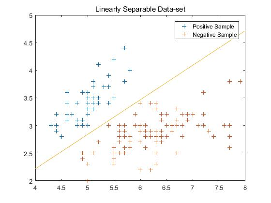

# ***Perceptron*** 笔记
## 算法简介
对于输入空间, 输出, 用以下模型分类
  
     

 其中为权重向量*weight vector*,  *x* 为输入空间的实例, 为偏置*bias*. 函数 *sgin(x)* 定义如下:  

可知感知机为线性分类器 *Linear Classcifier*.  
当    可以视为分离  两类的超平面 *Separating Hyerplain*. 在二维输入空间中，*Separating Hyperplane*为一条直线，如下图所示.

  为直线  的法向量.  
在高维空间， 为分离超平面 *Separating Hyperplane* 的法向量. 以下为证明过程:  

---
设点 *A、B* 为分离超平面任意的两点，有  及  , 两式做差，则有  , 可得出结论 *w* 为分离超平面的法向量。 证毕！  

---
假设训练数据集为线性可分数据集 *(Linearly Separable Data-set)*, 则感知机的任务是找到一个超平面将正负实例点完全正确的分离. 为此我们需要找到一个函数对分类情况进行衡量，且这个函数是关于参数 *w* 和 *b* 的连续可导函数，目的是为了对这个函数优化. 可定义下面函数：  

  

其中 *M* 为误分类点集合, 具体推导过程见《统计学习方法》一书。下面使用梯度下降法优化 *Loss* 函数, 参数更新方式为：

\
 
 为学习率 *(Learning Rate)*.
  
2019-01-15 13:11 

